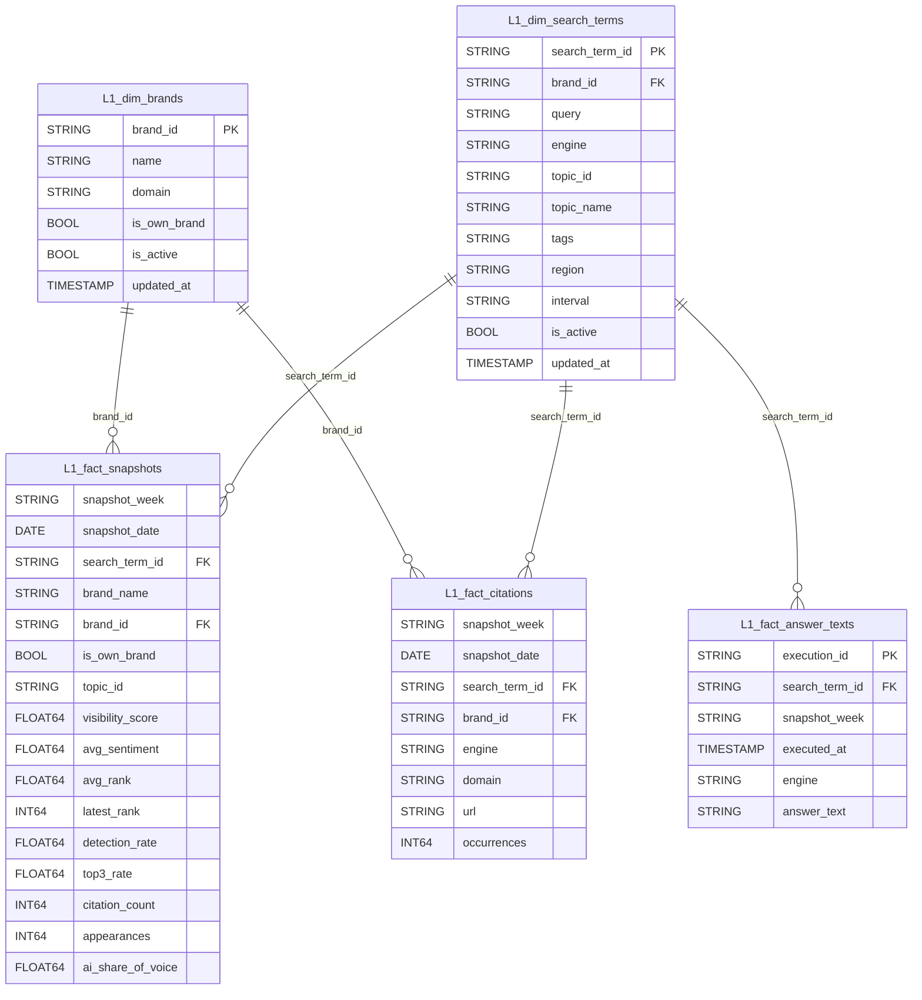

# L1 Tabulky — Datový model pro reporting

Transformovaná vrstva nad raw_ tabulkami. Připravena pro Keboolu → Snowflake → Tableau.
Žádná business logika není v ETL scriptu — vše se řeší zde.

---

## Přehled

```
raw_brands          ──┐
raw_search_terms    ──┤
raw_brand_snapshots ──┼──► Keboola transformace ──► L1_* tabulky ──► Snowflake ──► Tableau
raw_answer_texts    ──┤
raw_citations       ──┘
```

| Tabulka | Typ | Grain |
|---|---|---|
| `L1_dim_brands` | Dimenze | 1 řádek per brand |
| `L1_dim_search_terms` | Dimenze | 1 řádek per prompt × engine |
| `L1_fact_snapshots` | Fakt | 1 řádek per search_term × brand × snapshot_week |
| `L1_fact_citations` | Fakt | 1 řádek per search_term × engine × domain × url × snapshot_week |
| `L1_fact_answer_texts` | Fakt | 1 řádek per AI exekuce (execution_id) |

---

## Diagram závislostí



---

## Detailní popis tabulek

### L1_dim_brands

Číselník brandů — vlastní i sledovaní konkurenti.
Deduplikováno z `raw_brands` (latest per brand_id).

| Sloupec | Typ | Popis |
|---|---|---|
| `brand_id` | STRING | PK |
| `name` | STRING | Název brandu |
| `domain` | STRING | Doména |
| `is_own_brand` | BOOL | TRUE = vlastní brand |
| `is_active` | BOOL | FALSE = brand smazán v Rankscale |
| `updated_at` | TIMESTAMP | Kdy byl záznam naposledy aktualizován z API |

> Competitors bez `brand_id` **nejsou** v této tabulce — jsou identifikováni přes `brand_name` v `L1_fact_snapshots`.

---

### L1_dim_search_terms

Číselník promptů — zdroj pravdy pro topic, engine a tagy.
Deduplikováno z `raw_search_terms` (latest per search_term_id).

| Sloupec | Typ | Popis |
|---|---|---|
| `search_term_id` | STRING | PK |
| `brand_id` | STRING | FK → L1_dim_brands |
| `query` | STRING | Text promptu posílaného do AI enginu |
| `engine` | STRING | AI engine (`chatgpt_gui`, `google_ai_mode_gui`, ...) |
| `topic_id` | STRING | ID produktové vertikály |
| `topic_name` | STRING | Název vertikály (Půjčky, Hypotéky, Investice...) |
| `tags` | STRING | JSON string tagů, např. `["segment-a","top-funnel"]` |
| `region` | STRING | Geografický region (`cz`, `sk`, ...) |
| `interval` | STRING | Frekvence spouštění (`weekly`, `daily`) |
| `is_active` | BOOL | FALSE = prompt vypnut nebo smazán v Rankscale |
| `updated_at` | TIMESTAMP | |

**Filtrování podle tagu v SQL:**
```sql
WHERE 'top-funnel' IN UNNEST(JSON_VALUE_ARRAY(tags))
```

---

### L1_fact_snapshots ← hlavní tabulka reportu

Grain: **search_term × brand × snapshot_week** — jeden řádek per kombinaci.
Deduplikováno z `raw_brand_snapshots` (latest etl_loaded_at per grain).

| Sloupec | Typ | Popis |
|---|---|---|
| `snapshot_week` | STRING | ISO week, např. `2026-26` |
| `snapshot_date` | DATE | Datum Rankscale snapshotu |
| `search_term_id` | STRING | FK → L1_dim_search_terms |
| `brand_name` | STRING | Název brandu (vlastní i competitor) |
| `brand_id` | STRING | FK → L1_dim_brands (NULL pro nesledované competitors) |
| `is_own_brand` | BOOL | TRUE = vlastní brand |
| `topic_id` | STRING | Topic platný v době snapshotu (historicky správný) |
| `visibility_score` | FLOAT64 | 0–100; prominentnost zmínky v AI odpovědích |
| `avg_sentiment` | FLOAT64 | 0–100; 50 = neutrální, >50 pozitivní |
| `avg_rank` | FLOAT64 | Průměrná pozice (1 = nejlepší) |
| `latest_rank` | INT64 | Pozice v posledním snapshotu |
| `detection_rate` | FLOAT64 | % snapshotů kde byl brand detekován |
| `top3_rate` | FLOAT64 | % výskytů na pozici 1–3 |
| `citation_count` | INT64 | Počet citací |
| `appearances` | INT64 | Počet detekcí v daném období |
| `ai_share_of_voice` | FLOAT64 | Podíl visibility vlastního brandu vůči všem brandům v daném promptu a týdnu |

**Výpočet AI Share of Voice:**
```sql
visibility_score / NULLIF(SUM(visibility_score) OVER (
    PARTITION BY search_term_id, snapshot_week
), 0)
```

---

### L1_fact_citations

Grain: **search_term × engine × domain × url × snapshot_week**.
Deduplikováno z `raw_citations` (latest per grain).

| Sloupec | Typ | Popis |
|---|---|---|
| `snapshot_week` | STRING | ISO week |
| `snapshot_date` | DATE | |
| `search_term_id` | STRING | FK → L1_dim_search_terms |
| `brand_id` | STRING | FK → L1_dim_brands |
| `engine` | STRING | AI engine |
| `domain` | STRING | Citovaná doména, např. `banky.cz` |
| `url` | STRING | Konkrétní citovaná URL |
| `occurrences` | INT64 | Počet výskytů |

---

### L1_fact_answer_texts

Grain: **execution_id** — jedna unikátní AI odpověď.
Deduplikováno z `raw_answer_texts` (jeden řádek per execution_id).

| Sloupec | Typ | Popis |
|---|---|---|
| `execution_id` | STRING | PK — unikátní ID exekuce |
| `search_term_id` | STRING | FK → L1_dim_search_terms |
| `snapshot_week` | STRING | ISO week odvozený z executed_at |
| `executed_at` | TIMESTAMP | Kdy AI engine odpověděl |
| `engine` | STRING | AI engine |
| `answer_text` | STRING | Plný text AI odpovědi (markdown) |

---

## Jak pokrývá byznys požadavky

| Požadavek | Tabulka | Jak |
|---|---|---|
| Metriky per topic | `L1_fact_snapshots` JOIN `L1_dim_search_terms` | GROUP BY topic_name |
| Metriky per AI engine | `L1_fact_snapshots` JOIN `L1_dim_search_terms` | GROUP BY engine |
| Metriky per štítek/tag | `L1_fact_snapshots` JOIN `L1_dim_search_terms` | UNNEST(tags) + GROUP BY |
| Timeline vývoje | `L1_fact_snapshots` | GROUP BY snapshot_week |
| Jednotlivý prompt | `L1_fact_snapshots` | WHERE search_term_id = '...' |
| Vlastní brand vs. konkurence | `L1_fact_snapshots` | WHERE/PIVOT is_own_brand |
| AI Share of Voice | `L1_fact_snapshots` | Sloupec ai_share_of_voice |
| Citace per doména | `L1_fact_citations` | GROUP BY domain |
| Raw texty odpovědí | `L1_fact_answer_texts` | WHERE search_term_id = '...' |
