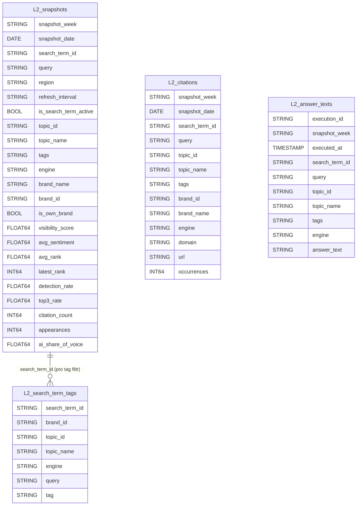

# L2 Tabulky — Denormalizovaná vrstva pro BI nástroje

Plně joinovaná vrstva nad L1 tabulkami. Připravena pro přímé napojení Tableau / Power BI / Looker Studio.
V BI nástroji žádné transformace — jen filtrovat a vizualizovat.

---

## Přehled

```
L1_dim_brands        ──┐
L1_dim_search_terms  ──┤
L1_fact_snapshots    ──┼──► transform_l2.sql ──► L2_* tabulky ──► Tableau / Power BI
L1_fact_citations    ──┤
L1_fact_answer_texts ──┘
```

| Tabulka | Grain | Použití |
|---|---|---|
| `L2_snapshots` | search_term × brand × snapshot_week | Hlavní tabulka pro všechny metriky |
| `L2_search_term_tags` | search_term × tag | Filtrování podle štítku (bridge tabulka) |
| `L2_citations` | search_term × engine × domain × url × snapshot_week | Analýza citovaných zdrojů |
| `L2_answer_texts` | execution_id | Zobrazení plných textů AI odpovědí |

---

## Diagram



---

## Detailní popis tabulek

### L2_snapshots — hlavní tabulka

Jeden řádek per **search_term × brand × snapshot_week**. Obsahuje vše potřebné pro metrické pohledy bez dalšího joinování.

| Sloupec | Typ | Popis |
|---|---|---|
| `snapshot_week` | STRING | ISO week, např. `2026-26` |
| `snapshot_date` | DATE | Datum Rankscale snapshotu (PARTITION key) |
| `search_term_id` | STRING | ID promptu |
| `query` | STRING | Text promptu posílaného do AI enginu |
| `region` | STRING | Geografický region (`cz`, `sk`, ...) |
| `refresh_interval` | STRING | Frekvence (`weekly`, `daily`) |
| `is_search_term_active` | BOOL | FALSE = prompt vypnut nebo smazán |
| `topic_id` | STRING | ID produktové vertikály |
| `topic_name` | STRING | Název vertikály (Půjčky, Hypotéky, Investice...) |
| `tags` | STRING | JSON string tagů — pro filtrování použi `L2_search_term_tags` |
| `engine` | STRING | AI engine (`chatgpt_gui`, `google_ai_mode_gui`, ...) |
| `brand_name` | STRING | Název brandu (vlastní i competitor) |
| `brand_id` | STRING | ID brandu (NULL pro nesledované competitors) |
| `is_own_brand` | BOOL | TRUE = vlastní brand |
| `visibility_score` | FLOAT64 | 0–100; prominentnost zmínky v AI odpovědích |
| `avg_sentiment` | FLOAT64 | 0–100; 50 = neutrální, >50 pozitivní |
| `avg_rank` | FLOAT64 | Průměrná pozice (1 = nejlepší) |
| `latest_rank` | INT64 | Pozice v posledním snapshotu |
| `detection_rate` | FLOAT64 | % snapshotů kde byl brand detekován |
| `top3_rate` | FLOAT64 | % výskytů na pozici 1–3 |
| `citation_count` | INT64 | Počet citací |
| `appearances` | INT64 | Počet detekcí v daném období |
| `ai_share_of_voice` | FLOAT64 | Podíl visibility vlastního brandu vůči všem brandům v daném promptu a týdnu |

**Typické dotazy přímo z této tabulky (nula joinů):**

```sql
-- Vývoj visibility v čase per topic
SELECT snapshot_week, topic_name, AVG(visibility_score)
FROM L2_snapshots
WHERE is_own_brand = TRUE
GROUP BY 1, 2
ORDER BY 1;

-- Porovnání vlastní brand vs. konkurence na konkrétním promptu
SELECT snapshot_week, brand_name, is_own_brand, visibility_score, ai_share_of_voice
FROM L2_snapshots
WHERE search_term_id = 'abc123'
ORDER BY snapshot_week, is_own_brand DESC;

-- Metriky per engine za poslední týden
SELECT engine, AVG(visibility_score), AVG(avg_sentiment)
FROM L2_snapshots
WHERE is_own_brand = TRUE
  AND snapshot_week = FORMAT_DATE('%G-%V', CURRENT_DATE())
GROUP BY engine;
```

---

### L2_search_term_tags — bridge tabulka pro tagy

Jeden řádek per **search_term × tag**. Umožňuje správné filtrování podle štítku v BI nástroji.

| Sloupec | Typ | Popis |
|---|---|---|
| `search_term_id` | STRING | FK → L2_snapshots |
| `brand_id` | STRING | Čí brand prompt patří |
| `topic_id` | STRING | ID vertikály |
| `topic_name` | STRING | Název vertikály |
| `engine` | STRING | AI engine |
| `query` | STRING | Text promptu |
| `tag` | STRING | Jeden konkrétní štítek |

**Použití pro filtr by tag (1 join):**

```sql
SELECT s.*
FROM L2_snapshots s
JOIN L2_search_term_tags t ON t.search_term_id = s.search_term_id
WHERE t.tag = 'product-brand'
  AND s.is_own_brand = TRUE;
```

V Tableau / Power BI: nastav relationship `L2_snapshots.search_term_id = L2_search_term_tags.search_term_id` a přidej `tag` jako filtr dimenzi.

---

### L2_citations — flat citace

Jeden řádek per **search_term × engine × domain × url × snapshot_week**. Vše potřebné pro analýzu citovaných zdrojů bez dalšího joinování.

| Sloupec | Typ | Popis |
|---|---|---|
| `snapshot_week` | STRING | ISO week |
| `snapshot_date` | DATE | PARTITION key |
| `search_term_id` | STRING | ID promptu |
| `query` | STRING | Text promptu |
| `topic_id` | STRING | ID vertikály |
| `topic_name` | STRING | Název vertikály |
| `tags` | STRING | JSON string tagů |
| `brand_id` | STRING | Čí monitoring citaci zachytil |
| `brand_name` | STRING | Název brandu (monitoring kontext) |
| `engine` | STRING | AI engine |
| `domain` | STRING | Citovaná doména, např. `banky.cz` |
| `url` | STRING | Konkrétní citovaná URL |
| `occurrences` | INT64 | Počet výskytů v daném týdnu |

---

### L2_answer_texts — flat texty AI odpovědí

Jeden řádek per **execution_id** (unikátní AI odpověď). Pro zobrazení plných textů v BI nebo pro export do dalšího zpracování.

| Sloupec | Typ | Popis |
|---|---|---|
| `execution_id` | STRING | PK — unikátní ID exekuce |
| `snapshot_week` | STRING | ISO week odvozený z `executed_at` |
| `executed_at` | TIMESTAMP | Kdy AI engine odpověděl (PARTITION key) |
| `search_term_id` | STRING | ID promptu |
| `query` | STRING | Text promptu |
| `topic_id` | STRING | ID vertikály |
| `topic_name` | STRING | Název vertikály |
| `tags` | STRING | JSON string tagů |
| `engine` | STRING | AI engine |
| `answer_text` | STRING | Plný text AI odpovědi (markdown) |

---

## Jak pokrývá byznys požadavky

| Pohled z reportu | Tabulka | Jak |
|---|---|---|
| Timeline visibility/sentimentu v čase | `L2_snapshots` | GROUP BY snapshot_week |
| Metriky per topic | `L2_snapshots` | GROUP BY topic_name |
| Metriky per AI engine | `L2_snapshots` | GROUP BY engine |
| Metriky per štítek | `L2_snapshots` JOIN `L2_search_term_tags` | WHERE tag = '...' |
| Vlastní brand vs. konkurence | `L2_snapshots` | GROUP BY / filter is_own_brand |
| Jednotlivý prompt v čase | `L2_snapshots` | WHERE search_term_id = '...' |
| AI Share of Voice | `L2_snapshots` | Sloupec ai_share_of_voice |
| Top citované domény | `L2_citations` | GROUP BY domain ORDER BY SUM(occurrences) |
| Raw texty AI odpovědí | `L2_answer_texts` | WHERE search_term_id = '...' |

---

## Pořadí spouštění pipeline

```
rankscale_extract.py   →   raw_ tabulky
transform_l1.sql       →   L1_ tabulky
transform_l2.sql       →   L2_ tabulky
```

SQL: `sql/transform_l2.sql`
